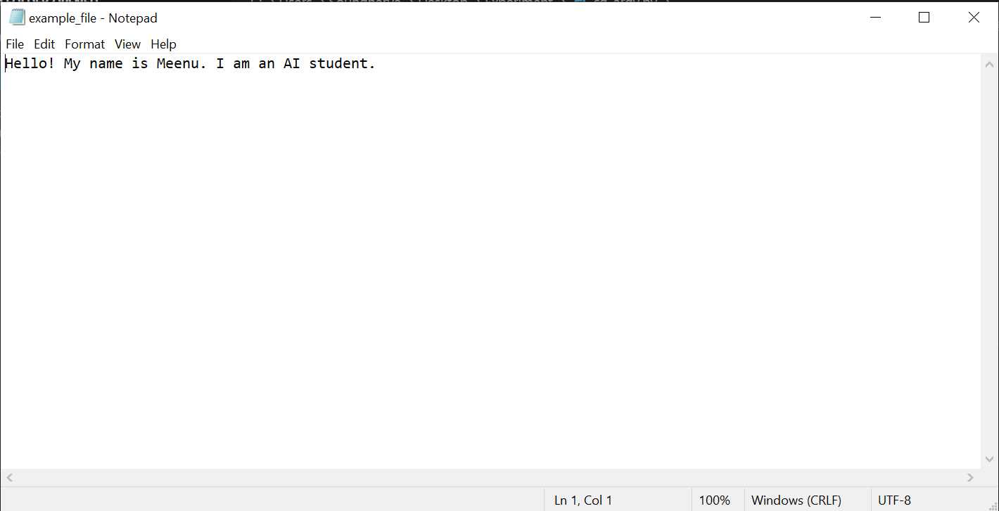

# Command line arguments to count word
## AIM:
To write a python program for getting the word count from the contents of a file using command line arguments.
## EQUIPEMENT'S REQUIRED: 
PC
Anaconda - Python 3.7
## ALGORITHM: 
### Step 1:
Create a text file in a specific loaction of interest.
### Step 2: 
On the same location as the text file, create a python program file. 
### Step 3: 
In python Program, import sys and open a text file with argument "sys.argv[1]".
### Step 4:  
Using read() and split(), split the lines in the file into a sequence of words.
### Step 5: 
Using len() count the number of words in the text file.
### Step 6: 
In command prompt, initiate python followed by program name and text file name to get the output.
## PROGRAM:
~~~PYTHON
#Program for getting the word count from the contents of a file using command line arguments
#Developed by :Meenu.S
#Register number: 23003303
import sys
f=open(sys.argv[1],'r')
a=f.read().split()
print("The number of words present in the file is :",len(a))

~~~

### OUTPUT:

## RESULT:
Thus the program is written to find the word count from the contents of a file using command line arguments.
